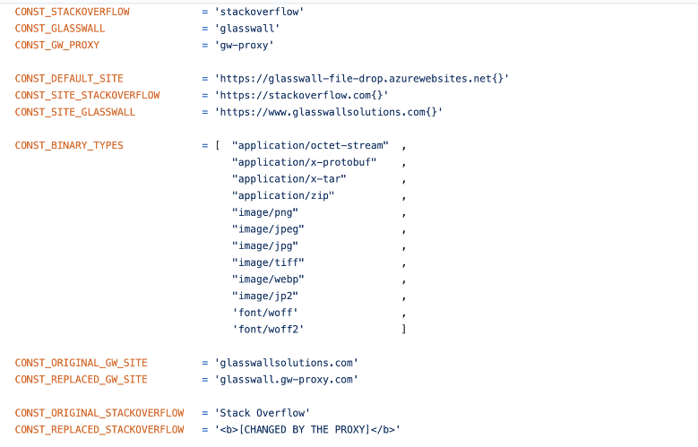

# k8-data-visualization

If you are working on this project via Upwork, see also our [Upwork Rules of Engagement](https://github.com/filetrust/Open-Source/blob/master/upwork/rules-of-engagement.md)

## Project Brief
Objective: Consume, process, normalize and visualize GitHub Issues data

* Glasswall ICAP project (see https://github.com/filetrust/program-icap) is currently under active development and there is a need to understand the exact issue status of all sub-projects

* There are a number of sub-projects (each with it's own set of issues)

  * https://github.com/filetrust/mvp-icap-service
  * https://github.com/filetrust/mvp-icap-cloud
  * https://github.com/filetrust/mvp-icap-squid-cache-proxy
  * https://github.com/filetrust/rebuild-k8s-filetypedetection
  * https://github.com/filetrust/icap-performance-tests
  * https://github.com/filetrust/rebuild-k8s
  * https://github.com/filetrust/k8-reverse-proxy

* At the moment we are using https://www.zenhub.com/extension to consolidate and understand the data, but there are a number of workflows that require the creation of data-connectors and custom visualizations

* Here is the recommended workflow for this project:

  * create API (Python or Node) to consume data from GitHub (all repos are public, so there is no dependency on Glasswall to provide access)
  * write Tests for all APIs created
  * create CI Pipeline
  * use Jupyter notebook to present data
  * create visualizations using native Jupyter APIs or other Javascript visualization APIs (like https://visjs.org/, https://plantuml.com/ , https://gojs.net/ , https://mermaid-js.github.io/)
  * transform data into graph-based objects and visualize them
  * create as much detailed technical documentation as possible (namely architecture and data-flow diagrams)
=======
These are the coding guidelines we tend to follow for Python projects at Glasswall

- [Code Formatting](#code-format)
- [Naming Conventions](#naming-conventions)
- [General](#general)

<a id="code-format"></a>
## Code Formatting

* Align formatting of code using common sense

* Parameter formatting (Readable and easy to find issues if any)

<br><br>

* Code lengths should be based on code readability (for example in the case below)

```
	CONST PARTNERED = 'We have partenered with multiple clients to look out '\
    
                       'for opportunities to get more clientelle'
```

 It is better to put all of that in one line

```
	CONST PARTNERED = 'We have partenered with multiple clients to look out for opportunities to get more clientelle'
```


<a id="naming-conventions"></a>
## Naming Conventions

* Keep separate classes in separate files

* Class names to follow upper camel case (class names should have underscores between words)
e.g
```
	class Http_Api_Issues:
```

* File names should match the class name. E.g. Above file to be saved as “Http_Api_Issues.py”

* Function names to follow lower camel case e.g

e.g.
```
def get_all_issues():
```

* We don’t follow any standards e.g. PEP. Code readability and easy to understand and debug are must.

E.g. Compare a more readable code

```
CONST_STACKOVERFLOW            = 'stackoverflow'
CONST_GLASSWALL                = 'glasswall'
CONST_GW_PROXY                 = 'gw-proxy'
```

With a lesser readable one

```
CONST_STACKOVERFLOW='stackoverflow'
CONST_GLASSWALL='glasswall'
CONST_GW_PROXY='gw-proxy'
```

* Put CONST (when used) on separate python, json or yaml files





<a id="general"></a>
## General

* Commit often and with clear commit messages

* You can use whatever font size or face you want, as long as that setting is not pushed to the main repo 

* Align formatting of code using common sense

